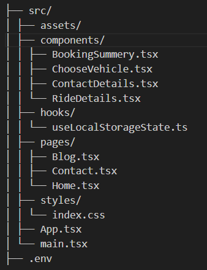

# **🚗 Tiffany Town Car – Booking App**
A sleek and responsive React + TypeScript transportation booking app built for a luxury town car service. 
Users can select their trip details, choose a vehicle, enter contact info, and confirm their reservation — 
all in a smooth, step-by-step flow with animated transitions.


## **🧠 Learnings**
- Handling multi-step forms in React with TypeScript
- Using local storage for temporary user data
- Designing with Tailwind CSS animations for smooth UX
- Creating modular reusable components


## **💡 Usage Flow**
- Home: Start booking → choose pickup/drop-off
  - Ride Details: Choose date, time, and ride type
  - Vehicle Selection: Pick a vehicle and see price
  - Contact Details: Fill out passenger information
  - Summary: Review and confirm your booking


## **🧱 Project Structure**



## **⚙️ Tech Stack**
| Tech | Purpose |
|----------|--------------|
| React (TypeScript) | Frontend framework |
| Vite | Fast bundler and dev environment |
| Tailwind CSS 4.1.16 | Styling and animations |
| React Router DOM | Routing between pages |
| Local Storage API | Persist user selections |

## **💬 Future Imporovment**
- Integrate Real-Time Google Maps Directions
- Add Payment Gateway Integration
- Email & SMS Confirmation

## **⚙️ Getting Started**

```bash
# 1️⃣ Clone the repository
git clone https://github.com/karoline-sol/Tiffany-Town-Car.git

# 2️⃣ Navigate into the project folder
cd Tiffany-Town-Car

# 3️⃣ Install dependencies
npm install

# 4️⃣ Create a .env file and add your Google Maps API key
echo "VITE_GOOGLE_MAPS_API_KEY=your_api_key_here" > .env

# 5️⃣ Start the development server
npm run dev
```

## **Made with ❤️ & TypeScript By**:

Caroline Soliman:
https://github.com/karoline-sol?tab=repositories

Fady Soliman:
https://github.com/Fadyhub007?tab=repositories